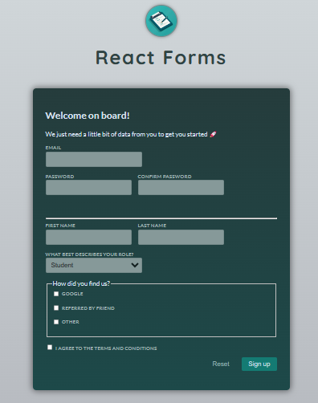
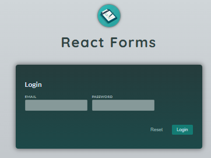

# React Sign Up and Login Page

This is a simple web application built with React for user authentication. It provides functionality for users to sign up for a new account and log in with existing credentials.

## Features

- User sign up: Allow users to create a new account by providing necessary information.
- User login: Enable users to log in with their credentials.
- Authentication: Implement authentication mechanisms to ensure secure access to the application.

## Technologies Used

- React: JavaScript library for building user interfaces.

## Credits:
This project is inspired by React - The Complete Guide 2024 (incl. React Router & Redux).

## License:
This project is licensed under BenHammouda Mohamed Ali.

### Sign Up:

### Login Page:

